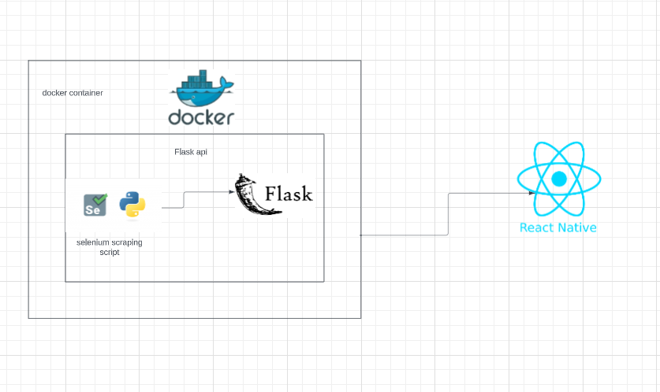
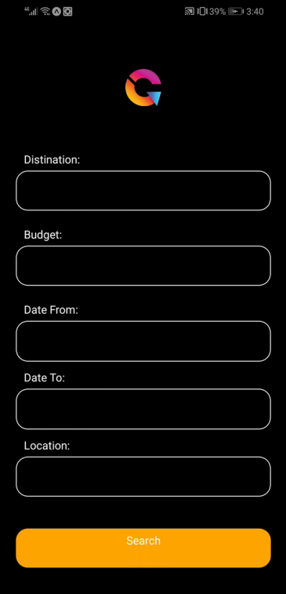
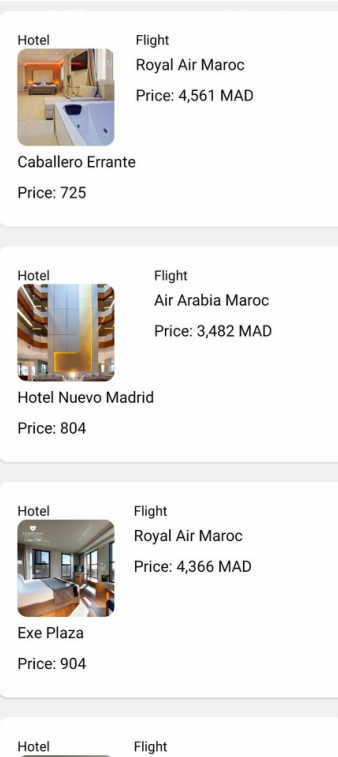

# Holiday Destination Recommender App



## Overview

The Holiday Destination Recommender App is a mobile application that helps users find the best holiday destinations based on their budget and preferred travel dates. The app provides personalized recommendations and travel information to make planning your holidays a breeze. The project is divided into two main components: the frontend built with React Native and the backend built with Flask and Python Selenium. Docker is used for containerization to simplify deployment.

### Key Features

- User-friendly mobile app interface.
- Budget and date-based destination recommendations.
- Integration with web scraping (Python Selenium) to fetch real-time travel data.
- Docker containerization for easy deployment.

## Table of Contents

- [Installation](#installation)
- [Usage](#usage)
- [Backend](#backend)
- [Frontend](#frontend)
- [Contributing](#contributing)

## Installation

To get started with this project, follow these steps:

1. Clone the backend repository:

   ```bash
   git clone https://github.com/your-username/holiday-destination-recommender-backend.git
   cd holiday-destination-recommender-backend

2. Install frontend dependencies:

   ```bash
   npm install
3. Build and run backend docker image:

   ```bash
   docker build -t your-image-name .
   docker run -d --name your-container-name your-image-name
## Frontend

The frontend of this project is built with React Native, a popular mobile app development framework. It provides a user-friendly interface for users to input their travel preferences and receive destination recommendations.

## Backend

The backend of this project is built with Flask, a Python web framework, and utilizes Python Selenium for web scraping to fetch real-time travel data. It provides the API endpoints for the frontend to interact with.


## Usage

1. **Open the Holiday Destination Recommender App on your mobile device.**

2. **Fill in your budget and preferred travel dates in the provided form.**

3. **Submit the form to initiate the recommendation process.**

4. **The app will process your input and generate personalized holiday destination recommendations based on your budget and travel dates.**

5. **Explore the recommended destinations to view details, such as:**
   - Destination name
   - Description
   - Estimated cost
   - Travel tips

6. **Use the provided information to plan your dream holiday with confidence!**

Feel free to use the app whenever you need travel inspiration or assistance in planning your holidays. Enjoy your journey!

## Contributing

We welcome contributions to the frontend and backend of this project! If you'd like to contribute, please follow these guidelines:

1. Fork the respective frontend and backend repositories.

2. Create a new branch for your feature or bug fix: `git checkout -b feature-name`.

3. Make your changes and commit them: `git commit -m "Description of your changes"`.

4. Push your changes to your fork: `git push origin feature-name`.

5. Submit a pull request to the respective repositories.


